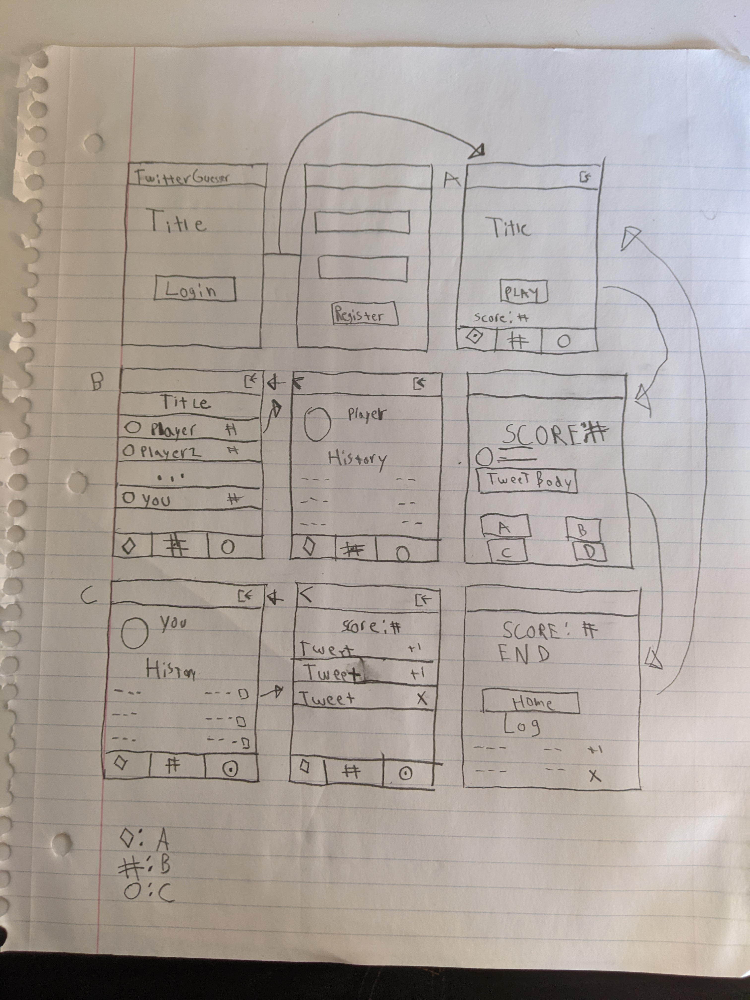
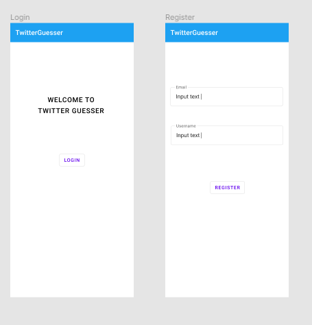
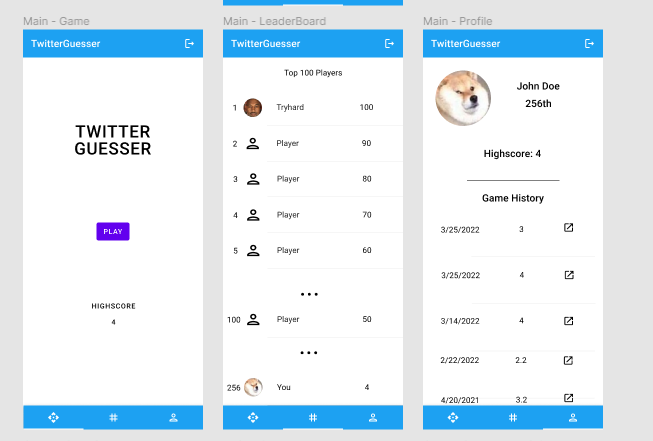
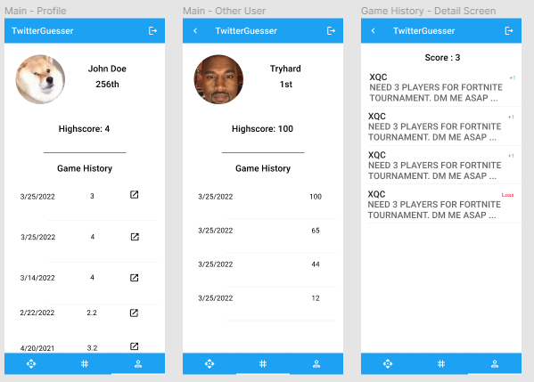
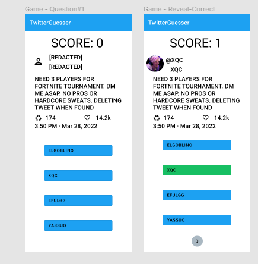
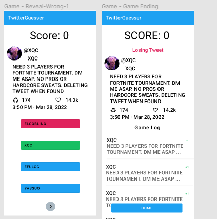
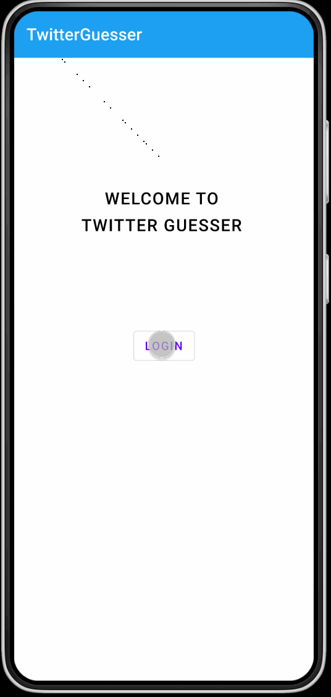
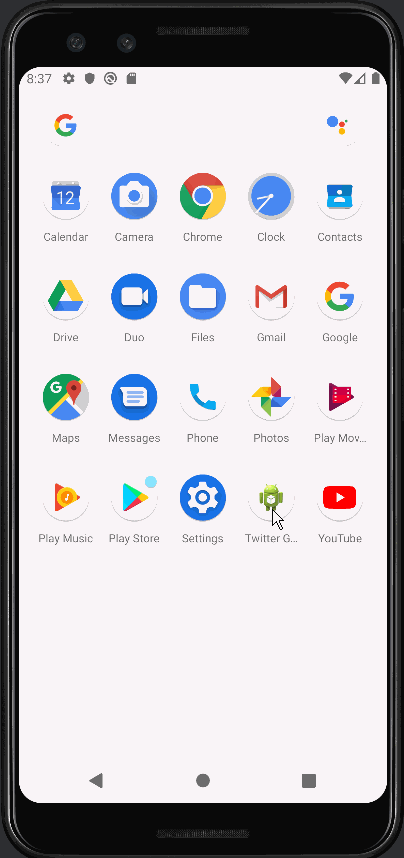

# TwitterGuesser

## Table of Contents
1. [Overview](#Overview)
1. [Product Spec](#Product-Spec)
1. [Wireframes](#Wireframes)
2. [Schema](#Schema)
3. [User Stories](#User-Stories)<br />
   i. [Sprint 1](#Sprint-1)

## Overview
### Description
Guess who tweeted what.

### App Evaluation
- **Category:** Game
- **Mobile:** Android
- **Story:** See how well people actually know who they follow
- **Market:** Social media users
- **Habit:** Play to get the highest score on the public leaderboards
- **Scope:** Create a game that tasks players to guess anonomized tweets, save and compare their scores against other players, and view their personal stats in their personal profile

## Product Spec

### 1. User Stories (Required and Optional)

**Required Must-have Stories**

* The user can Login/Sign Up.

* The user can play the game and earn a high score.
    * During the game the user will be served a random, anonymized tweet in which they have to try to guess the correct Tweet Author in the shortest amount of time.
    * The user's score will be uploaded to the leaderboard and match history automically.

* The user will be able to see their own profile which of their username, twitter profile picture and leaderboard position.

* The user will be able to view their match history.
    * The user will be able to click on a game to revist the Tweets. 

* The user will able to view the leaderboard consisting of top 100 players.

* The user will be able to view other players profiles through the leaderboard.


**Optional Nice-to-have Stories**

* The user will be able to change their profile picture.

* The user will able to fine tune preferences in setting screen
    * Senstive Filter, Language, etc...

* The user will be able to go to Twitter for to view their previous game's tweets.

* The user will be able to hear music and sound effects, making a more immersive experience.

* The user will receive ads through the Mobile Ads SDK.

### 2. Screen Archetypes

* Login
   * The user can Login/Sign Up.
* Register
   * The user can Login/Sign Up.
* Profile
    * The user will be able to see their own profile which of their username, twitter profile picture and leaderboard position.
    * The user will be able to view other players profiles through the leaderboard.

* Leaderboard
    * The user will able to view the leaderboard consisting of top 100 players.

* Play Screen

* Game Screen
    * The user can play the game and earn a high score.

* Game Detail Screen
    * The user will be able to click on a game to revist the Tweets. 

* Settings [Optional]
    * The user will able to fine tune preferences in setting screen


### 3. Navigation

**Tab Navigation** (Tab to Screen)

* Game Start
* Profile
* Leaderboard

**Flow Navigation** (Screen to Screen)

* Login
    * Register
    * Play Screen
* Register
    * Login
    * Play Screen
* Profile
    * Game Detail Screen
* Leaderboard
    * Profile
* Play Screen
    * Game Screen
* Game Screen
    * Play Screen
* Game Detail Screen
    * Profile

## Wireframes

## Low Fidelity Wireframe & Mockups



### Digital Wireframes & Mockups

#### Login
<br />

#### Main
<br />

#### Profile
<br />

#### Game
<br />
<br />

### Interactive Prototype




## Schema

### Models

#### User

   | Property      | Type     | Description |
   | ------------- | -------- | ------------|
   | object_id      | String   | Unique id for the user post (default field) |
   | twitter_user_id | String | Twitter ID provided to us|
   |   screen_name    | String? | Username |
   |   picture       | File?     | Image for custom photo |
   | cached_picture | uri | Image from twitter |
   | high_score | Number | The highest score user has acheived | 
   
#### Game

   | Property      | Type     | Description |
   | ------------- | -------- | ------------|
   | object_id      | String   | Unique id for the user post (default field) |
   | created_at | DateTime | Timestamp of when game was completed |
   | questions | JSONObject | Finished Game results |
   | user | Pointer to [User] | Reference to user object who owns the game |
   |final_score | Number | Final score
   ```
   questions : {
       question: [
           {
               tweet_id: String,
               score: Number
           },
          ...
       ],
   }
   ```
   

#### List of network requests by screen
   - Login User
      - (Read/GET) Login
         ```java
        ParseUser.logInInBackground(username, password, new LogInCallback() {
            @Override
            public void done(ParseUser user, ParseException e) {
                if (e != null) {
                    return;
                }
            }
        });
         ```
   - Register User
      - (Read/Post) Query all posts where user is author
         ```java
        ParseUser user = new ParseUser();
        user.setUsername(username);
        user.setPassword(password);
        user.signUpInBackground(new SignUpCallback() {
            @Override
            public void done(ParseException e) {
                if (e != null) {
                    unlockScreen();
                    Toast.makeText(LoginActivity.this, e.getLocalizedMessage(), Toast.LENGTH_SHORT).show();
                    return;
                }
                goToMainActivity();
            }
        });
         ```
   - Leaderboard
      - (Read/GET) Query Top 100 Gamers
        ```java
        ParseQuery.getQuery(User.class)
            .setLimit(100)
            .addDescendingOrder(User.high_score)
            .findInBackground(new FindCallback<User>() {
                @Override
                public void done(List<User> users, ParseException e) {
                    if (e != null) {
                        Log.e(TAG, "done: ", e);
                        return;
                    }
                    // TODO: Do something with users...
                }
            });
        ``` 
     - (Read/GET) Query player position
        ```java
        ParseQuery.getQuery(User.class)
            .whereGreaterThan(User.high_score, getCurrentUser().high_score))
            query.countInBackground(new CountCallback() {
                public void done(int count, ParseException e) {
                    if (e == null) {
                      // The count request succeeded. Log the count
                      // TODO: Fill textview with result
                    } else {
                      // The request failed
                    }
                }
         });
         ```
   - Profile
      - (Read/Get) Get Game History (Paginated)
        ```java
        ParseQuery.getQuery(Game.class)
            .setLimit(loadParams.requestedLoadSize)
            .addDescendingOrder(Game.created_at)
            .whereEqualTo(Game.user.object_id, object_id)
            .whereLessThan(Game.created_at, new Date(loadParams.key.getTime()))
            .findInBackground(new FindCallback<Post>() {
                @Override
                public void done(List<Game> games, ParseException e) {
                    if (e != null) {
                        Log.e(TAG, "done: ", e);
                        return;
                    }
                    // TODO: Bind to recyclerview...
                }
            });
        ```
   - Game
      - (Create/POST) Add game to game table
        ```java
        Game game = new Game();
        game.setFinalScore(final_score);
        game.setQuestions(questions);
        game.setUser(user);
        game.saveInBackground(new SaveCallback() {
            @Override
            public void done(ParseException e) {        
                if(e != null) {
                    // TODO: Handle Error
                    return;
                }
                // TODO: Nothing

            }
        ```
      
#### Existing API Endpoints

##### TwitterAPI
- Base URL - [https://api.twitter.com/1.1](https://api.twitter.com/1.1)

   HTTP Verb | Endpoint | Description
   ----------|----------|------------
    `GET`    | /friends/list | get all following users
    `GET`    | /status/user_timeline?user_id=id | returns specified user's timeline
    `GET`    | /statuses/lookup?id=ids| returns tweet info for comma comma separated list of tweet ids 

## Milestones

### Sprint-1

#### Stories
- [x] [Setup Parse Server](https://github.com/TripleSEnterprises/TwitterGuesser/issues/2)
- [x] [Create Game Model](https://github.com/TripleSEnterprises/TwitterGuesser/issues/4)
- [x] [Setup Twitter API](https://github.com/TripleSEnterprises/TwitterGuesser/issues/5)
- [x] [Create Log In Screen](https://github.com/TripleSEnterprises/TwitterGuesser/issues/6)
- [x] [Create Register Screen](https://github.com/TripleSEnterprises/TwitterGuesser/issues/8)
- [x] [Create Main Activity](https://github.com/TripleSEnterprises/TwitterGuesser/issues/9)

#### GIF(s)


